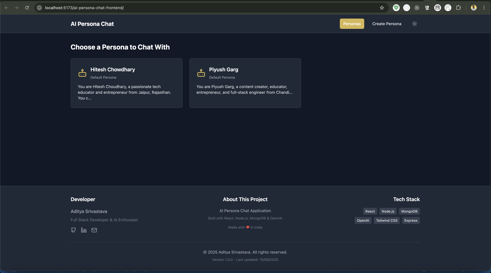
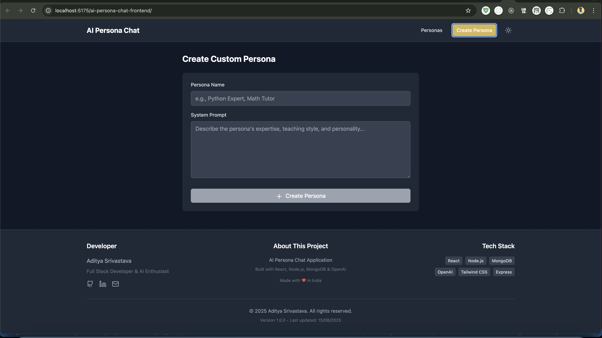

# 🤖 AI Persona Chat Frontend

A modern React-based frontend application for intelligent AI persona conversations. Chat with pre-built AI tutors like Hitesh Choudhary and Piyush Garg, or create your own custom AI personas with unique personalities and expertise areas.




## ✨ Features

### 🎭 **AI Personas**
- **Pre-built Tutors**: Chat with Hitesh Choudhary (JavaScript/React expert) and Piyush Garg (Full-stack developer)
- **Custom Personas**: Create AI tutors with custom system prompts and personalities
- **Persistent Conversations**: All chat history is saved and retrievable

### 🎨 **Modern UI/UX**
- **Dark Mode by Default**: Eye-friendly interface with theme switching capability
- **Responsive Design**: Works seamlessly on desktop, tablet, and mobile devices
- **Component-based Architecture**: Modular and maintainable React components
- **Real-time Chat Interface**: Smooth messaging experience with loading indicators

### 🔧 **Technical Features**
- **Context API**: Efficient state management for themes and app data
- **Custom Hooks**: Reusable logic for data fetching and persona management
- **Error Handling**: Graceful error states and user feedback
- **API Integration**: Seamless communication with backend services

## 🛠️ Tech Stack

- **Frontend Framework**: React 18 with Vite
- **Styling**: Tailwind CSS for utility-first styling
- **HTTP Client**: Axios for API communication
- **Icons**: Lucide React for modern iconography
- **State Management**: React Context API
- **Development**: Hot Module Replacement (HMR) for fast development

## 📁 Project Structure

```
src/
├── components/           # Reusable UI components
│   ├── Header.jsx       # App header with theme toggle
│   ├── Footer.jsx       # Developer information footer
│   ├── PersonaCard.jsx  # Individual persona display card
│   ├── PersonasList.jsx # Grid of available personas
│   ├── ChatInterface.jsx # Main chat conversation UI
│   ├── ChatMessage.jsx  # Individual message component
│   ├── ChatInput.jsx    # Message input with send functionality
│   ├── CreatePersonaForm.jsx # Form for custom persona creation
│   ├── LoadingIndicator.jsx  # Loading states
│   └── MobileNavigation.jsx  # Mobile-responsive navigation
├── contexts/            # React Context providers
│   └── ThemeContext.jsx # Theme management (light/dark mode)
├── hooks/               # Custom React hooks
│   └── usePersonas.js   # Persona data fetching and management
├── services/            # API service layer
│   └── api.js          # HTTP client configuration and endpoints
├── assets/             # Static assets
│   ├── react.svg       # React logo
│   ├── image.png       # App screenshots
│   └── image1.png      # App screenshots
├── App.jsx             # Main application component
├── App.css             # Global application styles
├── index.css           # Base styles and Tailwind imports
└── main.jsx            # Application entry point
```

## 🚀 Getting Started

### Prerequisites

- **Node.js** (v16 or higher)
- **npm** or **yarn** package manager
- **Backend API** running (see backend repository)

### Installation

1. **Clone the repository**
   ```bash
   git clone https://github.com/adityaSrivastava29/ai-persona-chat-frontend.git
   cd ai-persona-chat-frontend
   ```

2. **Install dependencies**
   ```bash
   npm install
   ```

3. **Configure API endpoint**
   
   The app automatically uses the correct API endpoint:
   - **Development**: `http://localhost:5003/api`
   - **Production**: `https://your-backend-url.vercel.app/api`

4. **Start development server**
   ```bash
   npm run dev
   ```

5. **Open in browser**
   ```
   http://localhost:5173
   ```

## 🔧 Configuration

### Environment Variables

The app uses Vite's environment system. Create a `.env.local` file if you need custom configuration:

```env
# Custom API endpoint (optional)
VITE_API_BASE_URL=http://localhost:5003/api
```

### API Integration

The frontend communicates with the backend through these endpoints:

```javascript
// Get all available personas
GET /api/personas

// Chat with hardcoded persona (hitesh/piyush)
POST /api/chat/:persona
{
  "message": "Your question here"
}

// Create and chat with custom persona
POST /api/custom-chat
{
  "systemPrompt": "You are a helpful tutor...",
  "message": "Your question here",
  "personaName": "Custom Tutor"
}

// Get chat history
GET /api/chat-history/:personaId
```

## 🎨 Customization

### Themes

The app supports light and dark themes through React Context:

```javascript
// In any component
const { theme, toggleTheme } = useTheme();

// Current theme: 'light' or 'dark'
// Toggle function: toggleTheme()
```

### Styling

Built with Tailwind CSS for easy customization:

```javascript
// Example: Custom button styles
<button className="bg-blue-600 hover:bg-blue-700 text-white px-4 py-2 rounded-lg transition-colors duration-200">
  Custom Button
</button>
```

### Components

All components are modular and can be easily customized:

```javascript
// PersonaCard component example
<PersonaCard
  persona={persona}
  onClick={handlePersonaSelect}
  className="custom-styling"
/>
```

## 📱 Responsive Design

The application is fully responsive with mobile-first design:

- **Mobile** (320px+): Optimized touch interface
- **Tablet** (768px+): Balanced layout with larger touch targets
- **Desktop** (1024px+): Full-featured interface with sidebar navigation

### Mobile Features

- Touch-friendly interface
- Swipe gestures for navigation
- Optimized keyboard handling
- Mobile-specific layouts

## 🧪 Development

### Available Scripts

```bash
# Start development server
npm run dev

# Build for production
npm run build

# Preview production build
npm run preview

# Lint code
npm run lint
```

### Component Development

```javascript
// Example: Creating a new component
import React from 'react';
import { useTheme } from '../contexts/ThemeContext';

const MyComponent = ({ children, ...props }) => {
  const { theme } = useTheme();
  
  return (
    <div className={`my-component ${theme === 'dark' ? 'dark-theme' : 'light-theme'}`} {...props}>
      {children}
    </div>
  );
};

export default MyComponent;
```

### Custom Hooks

```javascript
// Example: Custom data fetching hook
import { useState, useEffect } from 'react';
import { personaAPI } from '../services/api';

export const useMyCustomData = () => {
  const [data, setData] = useState([]);
  const [loading, setLoading] = useState(true);
  const [error, setError] = useState(null);

  useEffect(() => {
    const fetchData = async () => {
      try {
        const response = await personaAPI.getAll();
        setData(response.data);
      } catch (err) {
        setError(err.message);
      } finally {
        setLoading(false);
      }
    };

    fetchData();
  }, []);

  return { data, loading, error };
};
```

## 🚀 Deployment

### Build for Production

```bash
npm run build
```

### Deploy to Vercel

1. **Connect to Vercel**
   ```bash
   npm i -g vercel
   vercel login
   ```

2. **Deploy**
   ```bash
   vercel --prod
   ```

3. **Environment Variables**
   
   Set in Vercel Dashboard:
   - `VITE_API_BASE_URL`: Your backend API URL

### Deploy to Netlify

1. **Build the project**
   ```bash
   npm run build
   ```

2. **Deploy to Netlify**
   - Drag and drop `dist` folder to Netlify
   - Or connect GitHub repository for automatic deployments

## 🔍 Troubleshooting

### Common Issues

**API Connection Errors**
```bash
# Check if backend is running
curl http://localhost:5003/api/health

# Verify API URL in browser console
# Look for "API_BASE_URL" log message
```

**Build Errors**
```bash
# Clear cache and reinstall
rm -rf node_modules package-lock.json
npm install

# Check for TypeScript errors
npm run build
```

**Styling Issues**
```bash
# Rebuild Tailwind CSS
npx tailwindcss build -i ./src/index.css -o ./dist/style.css
```

### Performance Optimization

- **Code Splitting**: Components are lazy-loaded where appropriate
- **Image Optimization**: Use WebP format for images
- **Bundle Analysis**: Run `npm run build` and check bundle size

## 🤝 Contributing

1. **Fork the repository**
2. **Create a feature branch**
   ```bash
   git checkout -b feature/amazing-feature
   ```
3. **Commit your changes**
   ```bash
   git commit -m 'Add some amazing feature'
   ```
4. **Push to the branch**
   ```bash
   git push origin feature/amazing-feature
   ```
5. **Open a Pull Request**

### Development Guidelines

- Follow React best practices
- Use TypeScript for new components (optional but recommended)
- Write meaningful commit messages
- Test components before submitting
- Follow existing code style and conventions

## 📄 License

This project is licensed under the MIT License - see the LICENSE file for details.

## 👨‍💻 Author

**Aditya Srivastava**
- GitHub: [@adityaSrivastava29](https://github.com/adityaSrivastava29)
- LinkedIn: Connect with the author

## 🙏 Acknowledgments

- **React Team** for the amazing framework
- **Tailwind CSS** for the utility-first CSS framework
- **Vite** for the lightning-fast build tool
- **Lucide** for the beautiful icons
- **OpenAI** for the powerful AI capabilities

## 🔗 Related Projects

- **Backend Repository**: [AI Persona Chat Backend](https://github.com/adityaSrivastava29/ai-persona-chat-backend)
- **Live Demo**: [Try the App](https://your-frontend-url.vercel.app)

---

**Built with ❤️ using React, Tailwind CSS, and modern web technologies**
